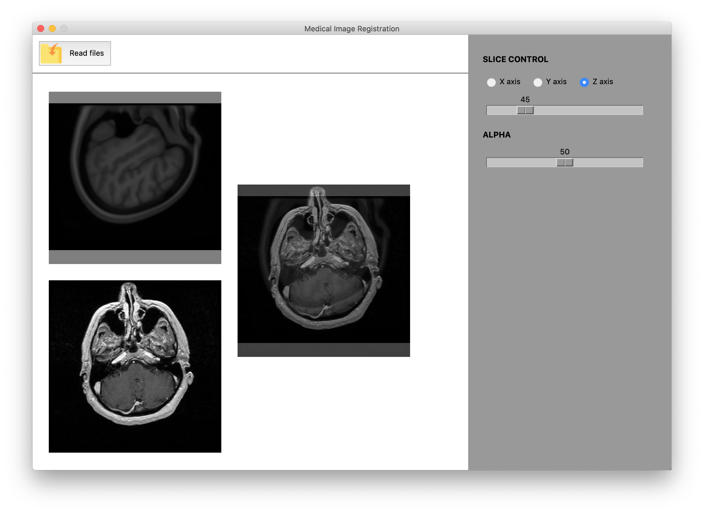
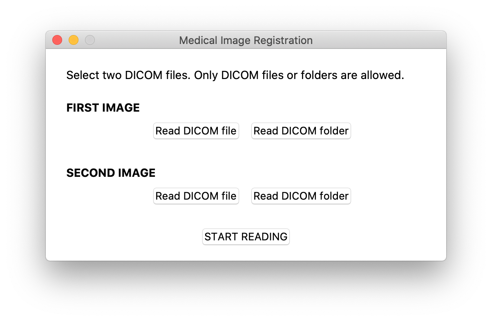

# Medical Image Tools

In this project, you will find the implementation of a system to carry out the registration of two medical images, as well as the segmentation of an image using techniques such as iso-contours and watershed.

In the current version, some improvements are achieved compared to the [MedicalImageViewer](https://github.com/mmunar97/MedicalImageViewer) project, such as:
- Possibility of reading DICOM files, or loading of folders that contain the DICOM file decomposed into layers.
- Crop the image to fit the view while maintaining the aspect ratio, filling the empty areas with a solid color.

Finally, it is also allowed to visualize the alpha sum between both images.

In this repository, you can find an implemented system for displaying medical images in DICOM format.

This system is programmed in Python under the Model-View-Controller architecture. Below, you can see a preview of the operation of the graphical interface, which allows:

- Upload a DICOM image using the system file explorer.
- Visualize 2D slices from the three-dimensional image.
- Explore the DICOM headers of the image.

